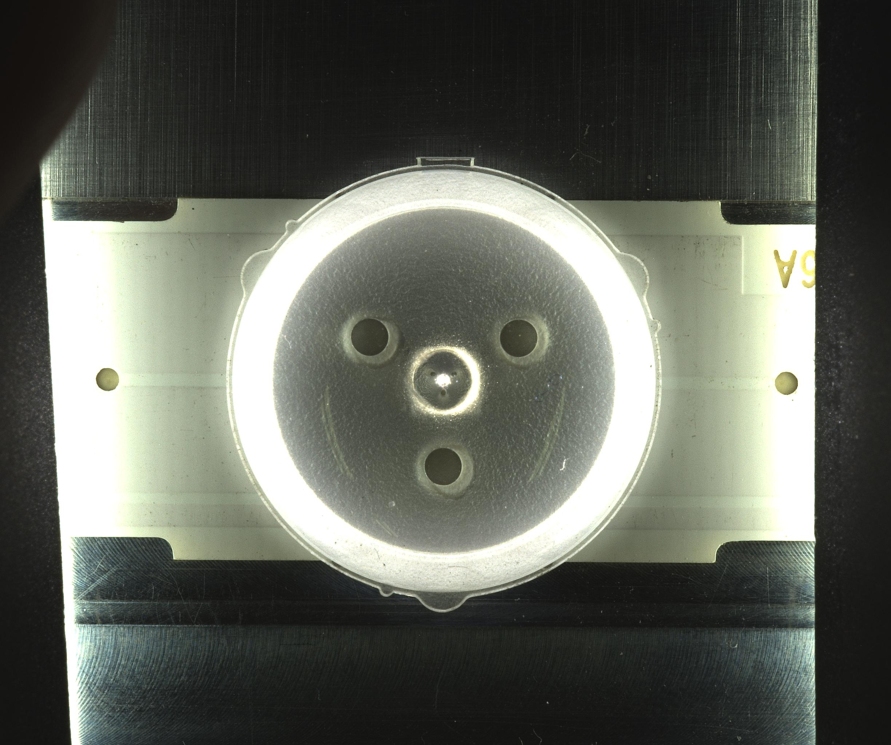
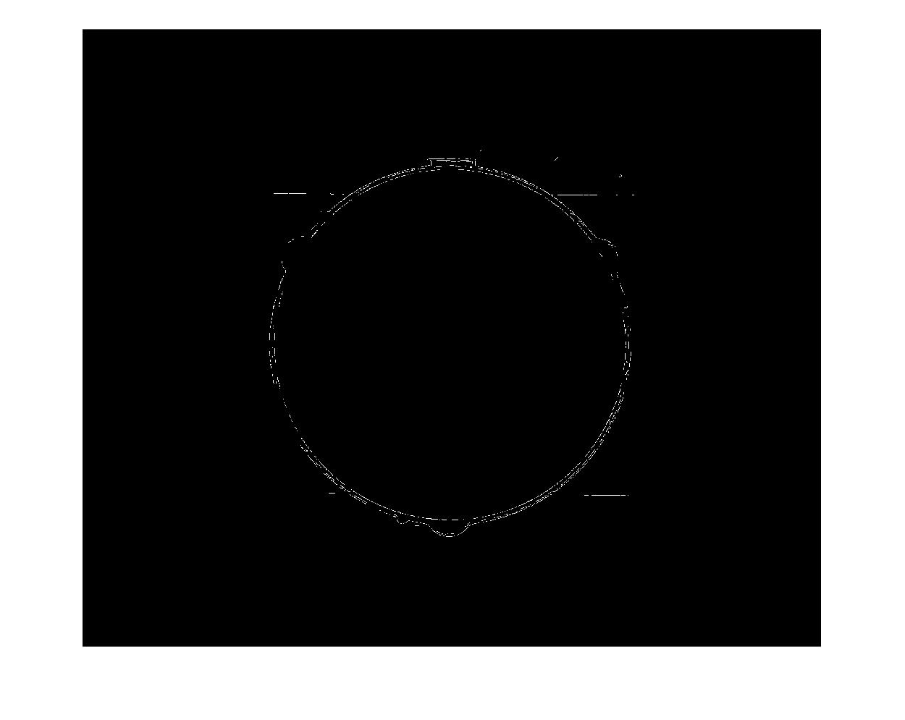
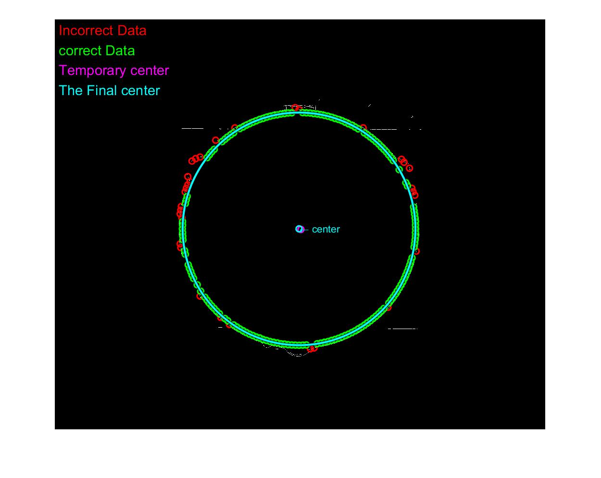

# FindLensCenter
Use 'regression analysis' to find the center of the digital lens.

회귀분석을 이용한 렌즈 중심 찾기 알고리즘 입니다. 

정밀도 문제 때문에 원형 허프 변환을 적용할 수 없어 회귀분석으로 해결합니다.

- Original

- Preprocessing

- Result

